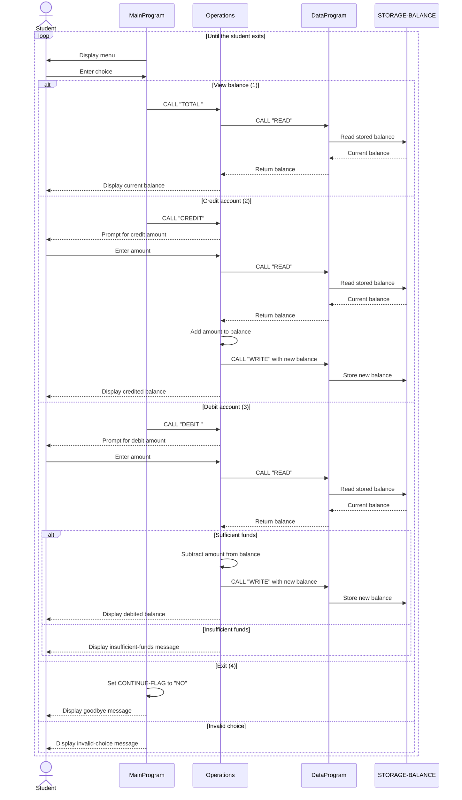

# Student Account COBOL Application

This directory documents the COBOL account-management sample. The application provides a console workflow for viewing a student account balance, crediting the account, debiting the account, and exiting.

## Source Files

### `src/cobol/main.cob`

`MainProgram` is the user-facing entry point. It:

- Displays the account-management menu.
- Accepts a menu choice from `1` through `4`.
- Dispatches the selected action to `Operations`.
- Keeps the menu running until the user selects Exit.
- Displays an error for any other menu choice.

The menu actions are:

| Choice | Operation code | Behavior |
| --- | --- | --- |
| 1 | `TOTAL ` | View the current balance |
| 2 | `CREDIT` | Add funds to the account |
| 3 | `DEBIT ` | Withdraw funds if sufficient funds exist |
| 4 | N/A | Exit the application |

### `src/cobol/operations.cob`

`Operations` implements account actions requested by the main program. It:

- Reads and displays the current balance for `TOTAL `.
- Prompts for an amount, reads the current balance, adds the amount, and saves the result for `CREDIT`.
- Prompts for an amount, reads the current balance, checks available funds, subtracts the amount, and saves the result for `DEBIT `.
- Displays an insufficient-funds message when a debit exceeds the current balance.

`Operations` delegates balance storage to `DataProgram` rather than updating the storage area directly.

### `src/cobol/data.cob`

`DataProgram` is the balance data-access module. It maintains the account balance and supports two operations:

- `READ`: copies the stored balance into the caller-provided balance field.
- `WRITE`: replaces the stored balance with the caller-provided balance.

The stored balance is initialized to `1000.00` and uses a numeric format that supports up to six whole-number digits and two decimal places.

## Student Account Business Rules

1. A student account starts with a balance of `1000.00`.
2. Viewing the balance does not change the account.
3. A credit increases the balance by the entered amount and persists the new balance.
4. A debit is allowed only when the current balance is greater than or equal to the entered amount.
5. A debit that exceeds the current balance is rejected and does not change the balance.
6. The application uses two decimal places for balances and transaction amounts.
7. Invalid menu choices do not perform an account operation.
8. The current implementation models one account only. It has no student identifier, account lookup, authentication, transaction history, or separate balances for multiple students.
9. The current implementation does not validate that entered credit or debit amounts are positive or otherwise well-formed. Input validation would be required before using this as a production student-account system.

## Module Flow

```text
MainProgram
    |-- TOTAL / CREDIT / DEBIT
    v
Operations
    |-- READ / WRITE
    v
DataProgram
    |-- STORAGE-BALANCE
```

## Sequence Diagram


